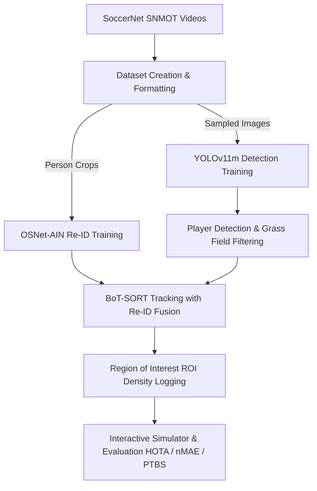

# SoccerNet Player Detection, Multi-Object Tracking & Re-Identification ⚽🏃‍♂️

[](https://www.python.org/)
[](https://pytorch.org/)
[](https://github.com/ultralytics/ultralytics)
[](https://opencv.org/)
[](https://github.com/JonathonLuiten/TrackEval)

An end-to-end computer vision and deep learning pipeline designed for the **SoccerNet Tracking (SNMOT)** challenge. This project implements player detection, multi-object tracking, identity re-identification (Re-ID), and spatial/tactical behavior analysis (ROI counting) on high-resolution broadcast soccer videos. 

---

## 📌 Project Architecture & Workflow

The project is structured into a multi-stage pipeline that moves from raw soccer broadcast video frames to visual annotations and evaluation scores.



---

## ⚙️ Core Components & Methodology

### 1. Dataset Generation (`dataset_creation_script.ipynb`)
Handles raw sequence acquisition, label consolidation, and frame/patch extraction.
* **Class Mapping**: Standardizes SoccerNet labels (`player`, `goalkeeper`, `goalkeepers`, `referee`) from `gameinfo.ini` files into a single target class `person` (ID `0`), while filtering out irrelevant classes like the `ball`.
* **Bounding Box Normalization**: Converts top-left coordinates `(x, y, w, h)` to normalized YOLO format:
  $$\text{center}_x = \frac{x + \frac{w}{2}}{\text{width}_{\text{img}}} \quad , \quad \text{center}_y = \frac{y + \frac{h}{2}}{\text{height}_{\text{img}}}$$
* **Detection Dataset Sampling**: Samples every **10th frame** to keep the dataset scale manageable, saving images and labels under `working/data_sampled/`.
* **Re-ID Crop Extraction**: Crops player bounding boxes (height $\ge 40$ pixels) from sampled frames. Crops are resized to $256 \times 128$ and saved in `reid_dataset/` grouped into folders by a unique identity string: `{sequence_name}_{tracklet_id}`.

### 2. Deep Learning Models & Training (`train.ipynb`)

#### A. Player Detection (YOLOv11m)
* Fine-tunes the **YOLOv11-medium** model at full $1920 \times 1080$ resolution.
* **Configurations**: Run for 50 epochs, batch size 1, patience 10, automatic optimization choice, and close mosaic augmentation for the last 10 epochs.
* **Target Output**: High-precision bounding boxes for soccer players under complex lighting, overlaps, and movement.

#### B. Player Re-Identification (OSNet-AIN)
* Fine-tunes **OSNet-AIN** (Omni-Scale Network with Instance-Batch Normalization), an architecture explicitly designed to capture scale-invariant features for person Re-ID.
* **Combined Loss System**: Employs a multi-task learning loss:
  $$\text{Loss} = \text{Loss}_{\text{CrossEntropy}} + \text{Loss}_{\text{BatchHardTriplet}}$$
* **Batch Construction**: Implements a custom `RandomIdentitySampler` selecting $P=16$ identities and $K=4$ image instances of each identity per batch (total batch size = 64) to ensure the Triplet Loss has challenging positive and negative pairs.
* **Optimization**: Adam optimizer with a learning rate of $1e-4$ and `MultiStepLR` scheduler (milestones at [15, 30] epochs, decay rate 0.1).

### 3. Multi-Object Tracking (`tracker_params.yaml` & `contest_setup.ipynb`)
Tracks players continuously using the **BoT-SORT** tracker from the `boxmot` library.
* **Global Motion Compensation (GMC)**: Configured with `sparseOptFlow` (Sparse Optical Flow) to dynamically compensate for swift camera pan, tilt, and zoom movements.
* **Re-ID Integration**: Integrates the fine-tuned OSNet-AIN features (`with_reid: True`) to calculate appearance distance. The appearance features are fused with spatial motion predictions (Kalman Filter) using matching thresholds to recover player IDs after occlusions or exits from the frame.
* **Hyperparameters**:
  * High tracking threshold: `0.25` | Low tracking threshold: `0.1` | New track creation: `0.45`
  * Matching IoU threshold: `0.7` | Proximity threshold: `0.9` | Appearance threshold: `0.2`
  * Track buffer length: `60` frames (maintains track memory for up to 60 frames without detection).

### 4. Grass Field Mask Filtering (`test_detector.ipynb`)
Broadcast sports footage contains distracting non-field regions (crowds, stadium stands, billboards). To minimize false positive player detections in those areas, a green-grass field mask is computed:
* **Static Mode**: Thresholds the frame using fixed green Hue-Saturation-Value (HSV) ranges, followed by morphological closing and convex hull approximation.
* **Adaptive Mode (Dynamic Calibration)**: Analyzes the bottom-middle region of each frame (where grass is statistically guaranteed) to compute a Hue histogram. It identifies the dominant green peak and establishes a dynamic HSV band around it:
  $$\text{Hue}_{\text{min}} = \max(0, \text{Peak} - 15) \quad , \quad \text{Hue}_{\text{max}} = \min(180, \text{Peak} + 15)$$
  It then isolates the main contour, applies `approxPolyDP` smoothing, and constructs a convex hull field mask.
* **Position Filtering**: Detections are kept only if the player's bottom-center coordinate (representing their feet/pitch intersection) falls inside the mask:
  $$\text{feet}_x = \frac{x_1 + x_2}{2} \quad , \quad \text{feet}_y = y_2$$

### 5. Tactical ROI Logging & Simulation (`SIMULATOR/`)
Analyzes player distribution inside dynamic stadium zones (Regions of Interest: ROI 1 & ROI 2) defined in `roi.json`:
* **Spatial Count**: Checks frame-by-frame if player feet coordinates are inside ROI 1 or ROI 2.
* **Behavior Logs**: Outputs player count per ROI to `behavior_{seq_name}_{group}.txt` alongside standard tracking output files `tracking_{seq_name}_{group}.txt`.
* **Side-by-Side Visualizer**: `simulator.py` launches a visual simulator showing Ground Truth (left) vs Tracker Predictions (right). It draws color-coded player bounding boxes (blue for ROI 1, red for ROI 2, yellow for out-of-ROI) and overlays active counts.
* **TrackEval Evaluation**:
  * **HOTA@0.50** (Higher Order Tracking Accuracy) is computed using the official `TrackEval` library at an IoU threshold of 0.50.
  * **nMAE** (normalized Mean Absolute Error) measures the accuracy of tactical density counting:
    $$\text{MAE} = \frac{1}{N}\sum |C_{\text{pred}} - C_{\text{gt}}| \quad , \quad \text{nMAE} = \frac{10 - \min(10, \max(0, \text{MAE}))}{10}$$
  * **PTBS** (Player Tracking Behavior Score) combines both metrics into a single score:
    $$\text{PTBS} = \text{HOTA@0.50} + \text{nMAE}$$

---

## 📁 Repository Directory Structure

```text
SoccerNet_Player_Detection_and_Tracking/
│
├── detection_models/                                
│   ├── others/                       # Alternative detection checkpoints
│   └── ft_1920_yolo11m.pt            # Best fine-tuned YOLOv11m weights (1920x1080)
│
├── reid_models/
│   ├── others/                       # Pre-trained base weights (MSMT17/ImageNet)
│   └── ft_osnet_ain_x1_0_imagenet.pt # Fine-tuned OSNet-AIN weights
│
├── SIMULATOR/            
│   ├── lecture_example_from_training/# Test splits and prediction folders
│   │   ├── Prediction_folder/        # Generated tracking & behavior txt outputs
│   │   └── test_set/videos/          # Test video sequences and ground truth
│   ├── evaluation_helper.py          # Data formatters, TrackEval wrappers, seqinfo writers
│   └── simulator.py                  # Side-by-side visualization GUI and PTBS evaluator
│
├── behavior_gt_generator.py          # Script to generate behavior_gt.txt from MOT GT files
├── contest_setup.ipynb               # End-to-end test inference loop (YOLOv11m + BoT-SORT + ReID + ROI)
├── dataset_creation_script.ipynb     # Downloading data, YOLO mapping, frame sampling, Re-ID cropping
├── osnet_ain.py                      # PyTorch implementation of OSNet with Instance-Batch Normalization
├── test_detector.ipynb               # Evaluates YOLO detector with static/adaptive field masking
├── tracker_params.yaml               # Hyperparameters for the BoT-SORT tracking algorithm
├── train.ipynb                       # Fine-tuning scripts for YOLOv11m and OSNet-AIN (Triplet Loss)
└── Project_Documentation.pdf         # Detailed project work report and analysis
```

---

## 🚀 Setup & Execution Guide

### 1. Requirements & Libraries
Install the necessary packages:
```bash
pip install ultralytics boxmot trackeval opencv-python pandas numpy PyYAML tqdm torch torchvision
```

### 2. Dataset Setup
Run all cells in `dataset_creation_script.ipynb` to:
1. Automatically download the SoccerNet tracking dataset splits.
2. Structure YOLO training/validation datasets under `working/data_sampled/`.
3. Extract cropped person patches under `reid_dataset/`.

### 3. Model Training
Open `train.ipynb` to execute:
* **Cell 1**: Fine-tune the YOLOv11m model on sampled field frames.
* **Cell 2**: Train the OSNet-AIN Re-ID model using Cross-Entropy and Triplet Loss.
* **Cell 3**: Convert weights format `.pth` to `.pt` removing parallel module tags.

### 4. Running Inference & Tracking
Execute the cells in `contest_setup.ipynb` to:
1. Load the fine-tuned YOLOv11m and OSNet-AIN weights.
2. Initialize BoT-SORT using parameters defined in `tracker_params.yaml`.
3. Run tracking on simulator video folders.
4. Filter detections, check ROI boundaries, and output logs to the `Predictions_folder`.

### 5. Running the Simulator & Evaluation
Execute `simulator.py` directly:
```bash
python SIMULATOR/simulator.py
```
This runs the interactive visual player comparison side-by-side, visualizes active ROI grids with live population trackers, and prints the official evaluation summary (**HOTA@0.50**, **nMAE**, and **PTBS**).
